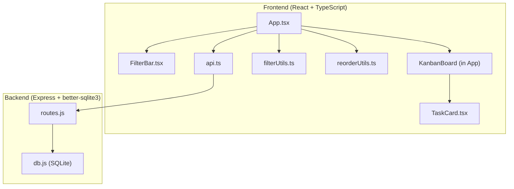

# Design Document: Kanban Drag-and-Drop Enhancements

## Overview

This design adds two major capabilities to the existing Kanban task manager: (1) within-column card reordering via HTML5 drag-and-drop with a persisted `sort_order` column, and (2) a client-side filter bar with text search, priority, category, and due-date filters. The implementation uses the browser's native HTML5 Drag and Drop API (no external library) and pure client-side filtering with no additional API calls for search/filter operations.

### Key Design Decisions

- **No drag-and-drop library**: The existing codebase already uses the HTML5 Drag and Drop API for cross-column status changes. We extend this pattern for within-column reordering rather than introducing a dependency like `@dnd-kit` or `react-beautiful-dnd`. This keeps the bundle small and avoids a new abstraction layer.
- **Client-side filtering**: All filter and search operations run against the in-memory task array. The full task list is fetched once on load; filters are pure functions applied before rendering. This avoids extra API round-trips and keeps the UI responsive.
- **Gap-based sort_order**: Sort order values use a gap strategy (multiples of 1000) to allow insertions without rewriting every row. When a card is dropped between two others, it gets the midpoint value. A full renormalization is sent to the backend only when gaps become too small.
- **Optimistic UI with rollback**: Reorder operations update the UI immediately, then persist via the backend. On failure, the UI reverts to the previous state.

## Architecture



### Data Flow

1. **Initial load**: `App` fetches all tasks, categories, and priorities from the backend. Tasks now include `sort_order`.
2. **Rendering**: Tasks are piped through `filterTasks()` (from `filterUtils.ts`), then grouped by status and sorted by `sort_order` ASC, `id` ASC within each column.
3. **Within-column drag**: User drags a card to a new position. `computeReorder()` (from `reorderUtils.ts`) calculates new sort_order values. The UI updates optimistically, then calls `PATCH /api/tasks/reorder`.
4. **Cross-column drag**: Existing behavior is preserved — status changes via `PUT /api/tasks/:id`. The task is assigned a sort_order at the bottom of the target column.
5. **Filtering**: User interacts with `FilterBar`. Filter state lives in `App` as React state. Changes trigger a re-render that applies `filterTasks()` to the full task list.

## Components and Interfaces

### New Components

#### `FilterBar`

A stateless component that renders the search input and filter dropdowns.

```typescript
interface FilterBarProps {
  searchQuery: string;
  onSearchChange: (query: string) => void;
  priorityFilter: number | null;       // null = "All Priorities"
  onPriorityChange: (id: number | null) => void;
  categoryFilter: number | null;       // null = "All Categories"
  onCategoryChange: (id: number | null) => void;
  dueDateFilter: DueDateFilterValue;
  onDueDateChange: (value: DueDateFilterValue) => void;
  priorities: Priority[];
  categories: Category[];
  hasActiveFilters: boolean;
  onClearAll: () => void;
}

type DueDateFilterValue = "all" | "overdue" | "today" | "this-week" | "no-date";
```

#### `reorderUtils.ts`

Pure utility functions for sort_order computation.

```typescript
// Compute new sort_order values after moving a task within a column
function computeReorder(
  columnTasks: Task[],       // tasks in the column, sorted by sort_order
  fromIndex: number,         // current position of the dragged task
  toIndex: number            // target position
): { id: number; sort_order: number }[];

// Compute the sort_order for a task being added to the bottom of a column
function computeBottomSortOrder(columnTasks: Task[]): number;
```

#### `filterUtils.ts`

Pure utility functions for filtering.

```typescript
interface FilterCriteria {
  searchQuery: string;
  priorityId: number | null;
  categoryId: number | null;
  dueDateFilter: DueDateFilterValue;
}

// Apply all active filters to a task list (logical AND)
function filterTasks(tasks: Task[], criteria: FilterCriteria): Task[];

// Individual filter predicates (exported for testing)
function matchesSearch(task: Task, query: string): boolean;
function matchesPriority(task: Task, priorityId: number | null): boolean;
function matchesCategory(task: Task, categoryId: number | null): boolean;
function matchesDueDate(task: Task, filter: DueDateFilterValue, today?: Date): boolean;
```

### Modified Components

#### `App.tsx`

- Add filter state: `searchQuery`, `priorityFilter`, `categoryFilter`, `dueDateFilter`
- Add `FilterBar` above the Kanban board
- Apply `filterTasks()` before rendering columns
- Enhance drag-and-drop handlers to distinguish within-column reorder from cross-column status change
- Track drop position within a column using `onDragOver` with element position calculation
- Show filtered counts in column headers
- Show empty state message when filters reduce a column to zero tasks

#### `TaskCard.tsx`

- No structural changes needed. The existing `draggable`, `onDragStart`, and `onDragEnd` props are sufficient.

#### `api.ts`

- Add `reorderTasks(items: { id: number; sort_order: number }[])` function calling `PATCH /api/tasks/reorder`.

### Backend Changes

#### `db.js`

- Add `sort_order INTEGER NOT NULL DEFAULT 0` column to the tasks table via migration logic.
- Backfill existing tasks with sequential sort_order values grouped by status.

#### `routes.js`

- Modify `GET /api/tasks` to order by `sort_order ASC, t.id ASC` within each status group.
- Modify `POST /api/tasks` to compute and assign `sort_order` at the bottom of the task's status column.
- Modify `PUT /api/tasks/:id` to assign a new `sort_order` at the bottom of the target column when status changes.
- Add `PATCH /api/tasks/reorder` endpoint.
- Include `sort_order` in the `formatTask` response.

## Data Models

### Updated Task Schema (SQLite)

```sql
CREATE TABLE IF NOT EXISTS tasks (
  id INTEGER PRIMARY KEY AUTOINCREMENT,
  title TEXT NOT NULL,
  description TEXT DEFAULT '',
  status TEXT NOT NULL DEFAULT 'todo'
    CHECK(status IN ('todo', 'in-progress', 'completed')),
  sort_order INTEGER NOT NULL DEFAULT 0,
  priority_id INTEGER NOT NULL,
  category_id INTEGER NOT NULL,
  due_date TEXT,
  created_at TEXT NOT NULL DEFAULT (datetime('now')),
  updated_at TEXT NOT NULL DEFAULT (datetime('now')),
  FOREIGN KEY (priority_id) REFERENCES priorities(id),
  FOREIGN KEY (category_id) REFERENCES categories(id)
);
```

### Updated TypeScript Types

```typescript
export interface Task {
  id: number;
  title: string;
  description: string;
  status: "todo" | "in-progress" | "completed";
  sort_order: number;
  due_date: string | null;
  created_at: string;
  updated_at: string;
  priority: Priority;
  category: Category;
}
```

### Reorder API Contract

```
PATCH /api/tasks/reorder
Content-Type: application/json

Request Body:
  { "items": [{ "id": number, "sort_order": number }, ...] }

Success Response (200):
  { "message": "Reorder successful" }

Error Responses:
  400: { "error": "items array is required and must not be empty" }
  404: { "error": "Task with id {id} not found" }
```

### Sort Order Strategy

- New tasks receive `sort_order = max(sort_order in column) + 1000`, or `1000` if the column is empty.
- Within-column reorder: `computeReorder` assigns new integer sort_order values to all tasks in the column based on their new positions, using increments of 1000 (e.g., 1000, 2000, 3000...). This full renormalization is simple and avoids fractional gaps.
- Cross-column drag: The moved task gets `computeBottomSortOrder(targetColumnTasks)`.

## Correctness Properties

*A property is a characteristic or behavior that should hold true across all valid executions of a system — essentially, a formal statement about what the system should do. Properties serve as the bridge between human-readable specifications and machine-verifiable correctness guarantees.*

### Property 1: New task sort_order is at the bottom of its column

*For any* set of existing tasks in a status column, when a new task is created with that status, its assigned `sort_order` SHALL be greater than the `sort_order` of every existing task in that column.

**Validates: Requirements 1.2**

### Property 2: Task list ordering invariant

*For any* set of tasks returned by the API, within each status group, tasks SHALL be ordered by `sort_order` ascending, with `id` ascending as a tiebreaker when sort_orders are equal.

**Validates: Requirements 1.3**

### Property 3: Reorder endpoint round-trip

*For any* valid array of `{ id, sort_order }` pairs where all IDs exist, after calling the reorder endpoint and then fetching the tasks, each task's `sort_order` SHALL equal the value specified in the reorder payload.

**Validates: Requirements 1.4**

### Property 4: Reorder transactional rollback on invalid ID

*For any* reorder payload containing at least one non-existent task ID, the endpoint SHALL return a 404 status and no task's `sort_order` SHALL be modified (all values remain unchanged from before the call).

**Validates: Requirements 1.6**

### Property 5: Within-column reorder computation preserves set and applies permutation

*For any* list of tasks in a column and any valid source/target index pair, `computeReorder` SHALL return sort_order values such that: (a) the task set is unchanged (same IDs), (b) the task at `fromIndex` appears at `toIndex` in the new ordering, and (c) all other tasks maintain their relative order.

**Validates: Requirements 2.1, 2.3**

### Property 6: Failed reorder reverts to previous state

*For any* column state and any reorder operation where the API call fails, the task list in the UI SHALL be identical to the state before the drag operation began.

**Validates: Requirements 2.4**

### Property 7: Cross-column drag places task at bottom of target column

*For any* task dragged from one status column to a different status column, the task's new `sort_order` SHALL be greater than the `sort_order` of every existing task in the target column.

**Validates: Requirements 2.5**

### Property 8: Text search filter correctness

*For any* set of tasks and any non-empty search string, `matchesSearch` SHALL return `true` if and only if the task's title or description contains the search string as a case-insensitive substring.

**Validates: Requirements 3.2**

### Property 9: Priority filter correctness

*For any* set of tasks and any selected priority ID, `matchesPriority` SHALL return `true` if and only if the task's priority ID equals the selected priority ID. When the filter is `null` (All Priorities), it SHALL return `true` for all tasks.

**Validates: Requirements 4.2**

### Property 10: Category filter correctness

*For any* set of tasks and any selected category ID, `matchesCategory` SHALL return `true` if and only if the task's category ID equals the selected category ID. When the filter is `null` (All Categories), it SHALL return `true` for all tasks.

**Validates: Requirements 5.2**

### Property 11: Due date filter correctness

*For any* set of tasks and any reference date:
- "overdue" SHALL match only non-completed tasks whose `due_date` is before the reference date.
- "today" SHALL match only tasks whose `due_date` equals the reference date.
- "this-week" SHALL match only tasks whose `due_date` falls within the Monday–Sunday week containing the reference date.
- "no-date" SHALL match only tasks whose `due_date` is null.
- "all" SHALL match all tasks.

**Validates: Requirements 6.2, 6.3, 6.4, 6.5**

### Property 12: Combined filter AND composition

*For any* set of tasks and any combination of active filters (search query, priority, category, due date), `filterTasks` SHALL return exactly the tasks that satisfy ALL active filter predicates simultaneously (logical AND).

**Validates: Requirements 7.1**

## Error Handling

### Backend

| Scenario | Response | Behavior |
|---|---|---|
| Empty reorder array | 400 `{ "error": "items array is required and must not be empty" }` | No database changes |
| Non-existent task ID in reorder | 404 `{ "error": "Task with id {id} not found" }` | Transaction rolled back, no changes |
| Invalid JSON body | 400 (Express default) | No database changes |
| Database write failure | 500 `{ "error": "Internal server error" }` | Transaction rolled back |

### Frontend

| Scenario | Behavior |
|---|---|
| Reorder API call fails | Optimistic UI reverts to pre-drag state; no error toast (silent revert) |
| Task creation fails | Existing error handling preserved (thrown error) |
| Status change API fails | Existing error handling preserved |
| Network offline during filter | No impact — filtering is client-side |

## Testing Strategy

### Property-Based Tests

The feature includes pure utility functions (`filterUtils.ts`, `reorderUtils.ts`) that are ideal candidates for property-based testing. We will use **fast-check** as the PBT library for TypeScript.

**Configuration:**
- Minimum 100 iterations per property test
- Each test tagged with: `Feature: kanban-drag-drop-enhancements, Property {N}: {title}`

**Properties to implement as PBT:**
- Property 1: New task sort_order at bottom (test `computeBottomSortOrder`)
- Property 2: Task list ordering invariant (test backend ordering logic or a sort utility)
- Property 3: Reorder endpoint round-trip (integration-level PBT with test DB)
- Property 4: Reorder transactional rollback (integration-level PBT with test DB)
- Property 5: Within-column reorder computation (test `computeReorder`)
- Property 8: Text search filter (test `matchesSearch`)
- Property 9: Priority filter (test `matchesPriority`)
- Property 10: Category filter (test `matchesCategory`)
- Property 11: Due date filter (test `matchesDueDate`)
- Property 12: Combined filter AND (test `filterTasks`)

### Unit Tests (Example-Based)

- Property 6: Failed reorder reverts state (mock API failure, verify UI state)
- Property 7: Cross-column drag bottom placement (specific scenarios)
- Drop indicator rendering during drag (Requirement 2.2)
- Drag source opacity class applied (Requirement 2.6)
- Filter bar renders all controls (Requirements 3.1, 4.1, 5.1, 6.1)
- "Clear All" resets all filters (Requirement 7.2)
- Active filter visual indicator (Requirement 7.3)
- Empty column message when filtered to zero (Requirement 7.4)
- Empty search matches all tasks (Requirement 3.3)
- Client-side only — no API calls during filtering (Requirements 3.4, 4.4, 5.4, 6.7)
- Empty reorder array returns 400 (Requirement 1.5)
- Sort_order column exists in schema (Requirement 1.1)

### Test File Structure

```
todo-app/frontend/src/utils/__tests__/filterUtils.test.ts    # PBT + unit tests for filter logic
todo-app/frontend/src/utils/__tests__/reorderUtils.test.ts   # PBT + unit tests for reorder logic
todo-app/backend/src/__tests__/reorder.test.js               # PBT + unit tests for reorder endpoint
```

### Dependencies to Add

- **Frontend**: `fast-check` (dev), `vitest` (dev, test runner)
- **Backend**: `fast-check` (dev), `vitest` (dev, test runner)
